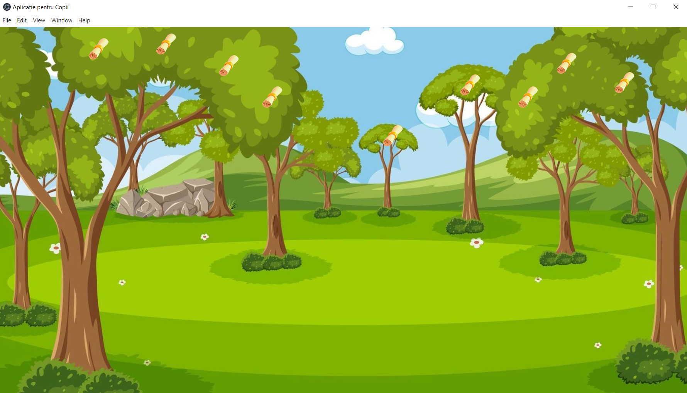
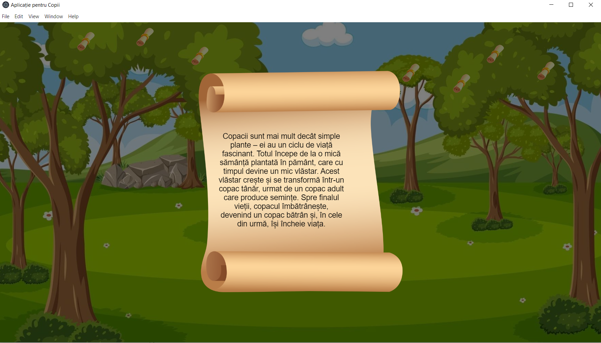
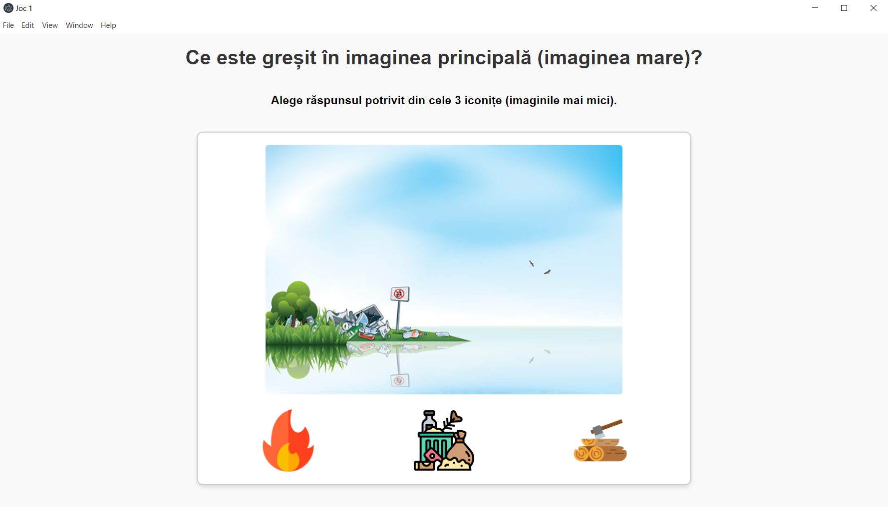
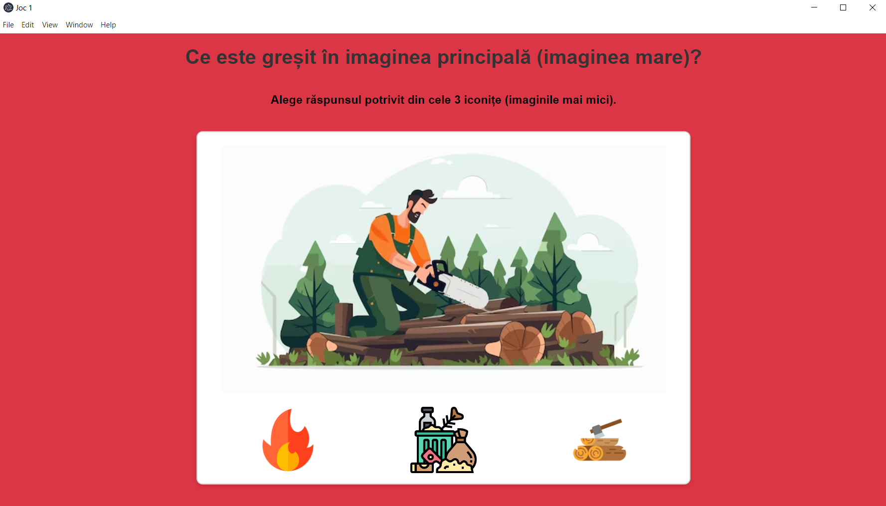
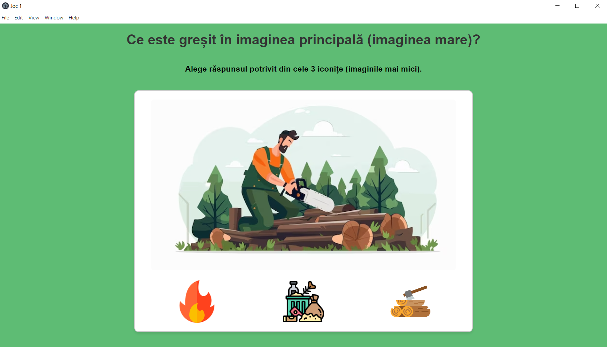
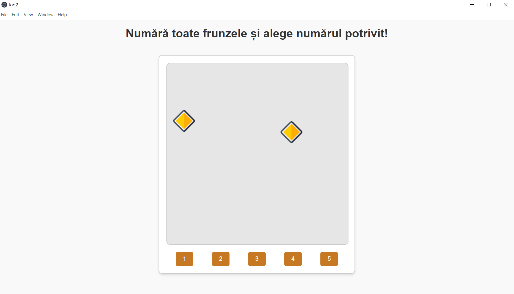
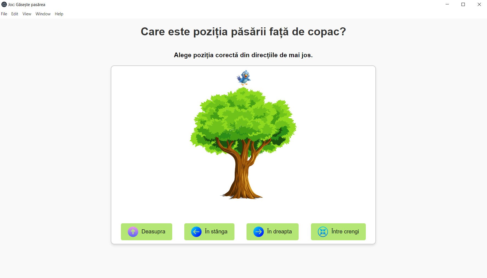
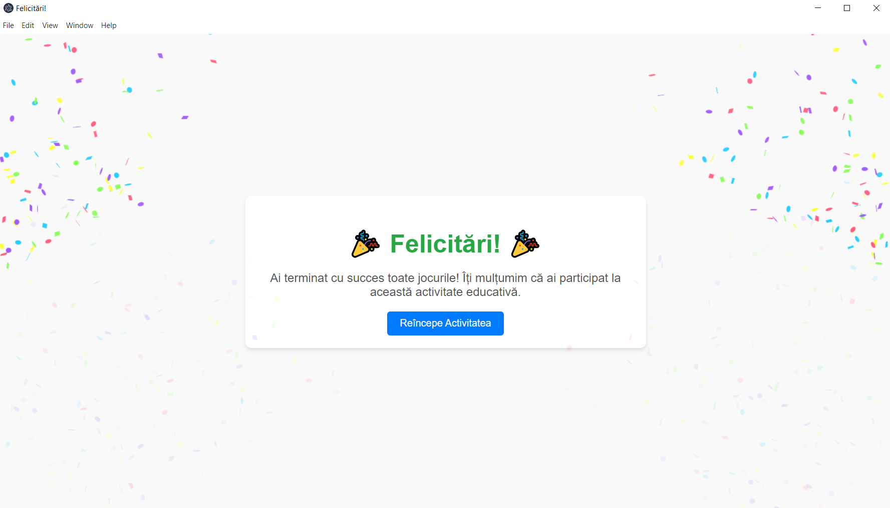

# 🐝 BrightBuds

**BrightBuds** este o aplicație desktop interactivă creată pentru copii, care îi ajută să învețe într-un mod plăcut și vizual despre **natură și copaci**, folosind **suport audio** și **mini-jocuri educative**.

---

## 🧠 Ce face aplicația

- Ajută copiii să învețe despre natură, mediu și forme geometrice.
- Include 3 jocuri interactive cu suport audio.
- Funcționează ca aplicație desktop cu suport pentru Windows și Mac.

---

## 📚 Partea educațională

|  |  |
|-----------------------------|-----------------------------|
| Introducere despre natură   | Informații despre copaci    |

---

## 🎮 Jocurile incluse

### 🔹 1. Ce este greșit în imagine?

Copilul alege elementul negativ din imagine (ex: foc, gunoi, defrișare).

| Imagine de joc             | Răspuns greșit           | Răspuns corect           |
|---------------------------|--------------------------|--------------------------|
|  |  |  |

---

### 🔹 2. Numără forma geometrică

|  |
|-----------------------------|
| Numără formele corect       |

---

### 🔹 3. Poziționare spațială

|  |
|-----------------------------|
| Alege direcția corectă      |

---

## 🏁 Final – terminarea mediului de învățare și jocuri

|  |
|-----------------------------|
| Imagine finală              |

## 🛠 Tehnologii folosite

